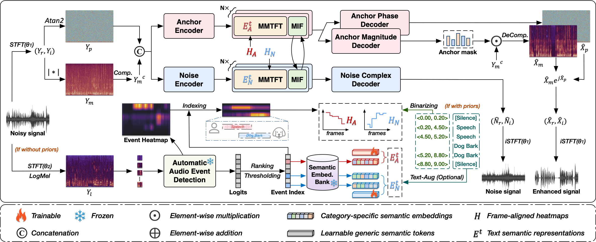

  <h1>DANSE</h1>

  

  

    <strong>Xincheng Yu, Jingxue Huang, Jian Zhang, Dongyue Guo, Jianwei Zhang, and Yi Lin*</strong>
  

  

    
    
    
    
  

  
<strong>DANSE</strong> is pronounced as <em>‘dance’</em> (/dɑːns/).

## Architecture

  

## Structure

-  `train.py`: Training entry. It supports training from scratch and resuming from split checkpoints.
-  `config.json`: Default config template.
-  `model/`: DANSE backbone, which will be made available concurrently with the release of `train.py`.
-  `g_best`: Released checkpoint, which will be made available concurrently with the release of `train.py`.
-  `inference.py`: Achieving both speech enhancement and noise estimation, which will be made available concurrently with the release of `train.py`. 

## Acknowledgements

We referred to [MP-SENet](https://github.com/yxlu-0102/MP-SENet) and [CLAP](https://github.com/LAION-AI/CLAP) to implement this.

## Contact Us

If you are interested in leaving a message to our research team, feel free to email xinchengyu@alu.scu.edu.cn.

  
  &nbsp;&nbsp;&nbsp;&nbsp;
  

